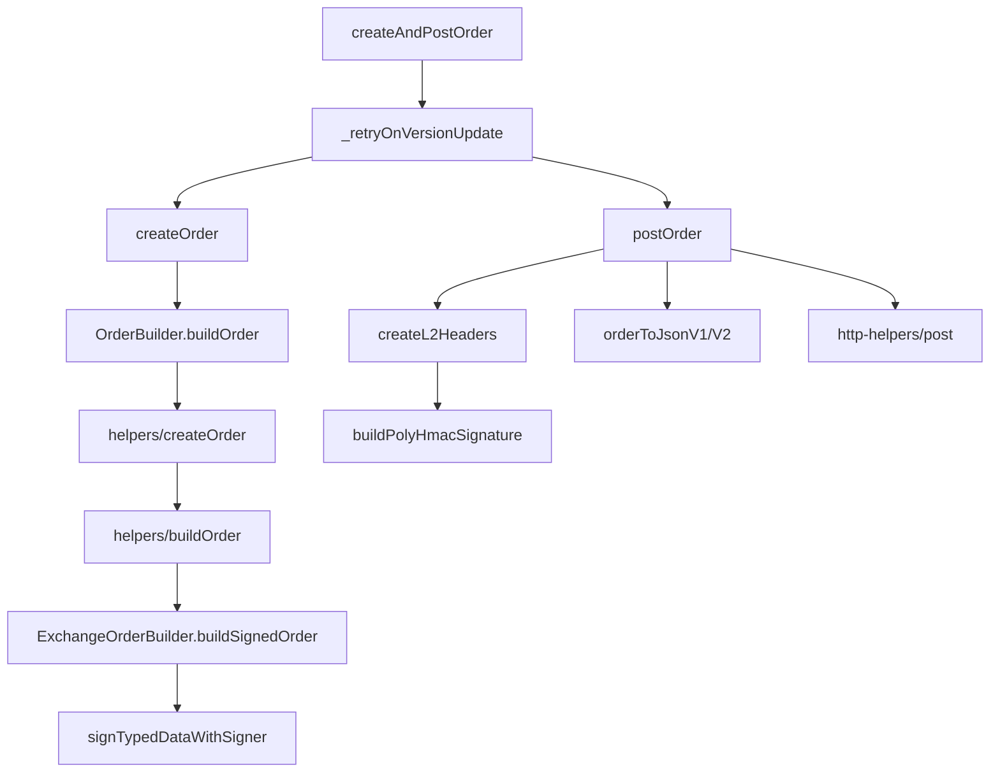

# 依赖分析：`ClobClient.createAndPostOrder`

> **目标函数**：`polymarket-clob/src/client.ts` · `ClobClient.createAndPostOrder`（L1024–L1038）  
> **假设变更 Y**：签名/鉴权行为变更（EIP-712 Order domain、TypedData 结构、HMAC 算法或 `POLY_*` 头格式）  
> **分析日期**：2026-06-11 · submodule: `polymarket-clob/`（`@polymarket/clob-client-v2`）

---

## 1. 它直接 import / require 了哪些东西？

`createAndPostOrder` 是类方法，**自身无 import 语句**；依赖通过 `ClobClient` 实例方法与模块级 import 间接获得。分两层说明。

### 1.1 函数级直接调用（同文件）

| 被调函数 | 文件 | 作用 |
|----------|------|------|
| `_retryOnVersionUpdate` | `polymarket-clob/src/client.ts` | 读取/缓存 Exchange 版本，最多执行 2 轮 create+post |
| `createOrder` | 同上 | Phase A：L1 校验、市场元数据、**EIP-712 Order 签名** |
| `postOrder` | 同上 | Phase B：JSON 序列化、**L2 HMAC 头**、`POST /order` |

函数本体：

```typescript
await this._retryOnVersionUpdate(async () => {
  const order = await this.createOrder(userOrder, options);
  postOrderResponse = await this.postOrder(order, orderType, postOnly, deferExec);
});
```

### 1.2 类型依赖（签名，非 runtime import）

| 类型 | 来源 |
|------|------|
| `UserOrderV1` \| `UserOrderV2` | `polymarket-clob/src/types/ordersV1.ts` / `ordersV2.ts` |
| `Partial<CreateOrderOptions>` | `polymarket-clob/src/types/clob.ts` |
| `OrderType.GTC` \| `OrderType.GTD` | `polymarket-clob/src/types/clob.ts` |
| 返回值 `Promise<any>` | 无显式类型，实际为 Polymarket `POST /order` 响应 JSON |

### 1.3 间接依赖：`createOrder` 子树（Order EIP-712）

| 模块 | 函数 / 符号 | 说明 |
|------|-------------|------|
| `client.ts` | `canL1Auth` | 要求 `this.signer` 存在 |
| `client.ts` | `_resolveTickSize` → `getTickSize` → `get` | 可能 REST 拉 tick |
| `utilities.ts` | `priceValid`, `roundNormal` | 价格校验与舍入 |
| `client.ts` | `resolveVersion` → `getVersion` | 可能 REST 拉 Exchange 版本 |
| `client.ts` | `getNegRisk` | 可能 REST 拉 negRisk |
| `client.ts` | `adjustBuyAmountForBalance` | 可选：余额感知缩量（v2+ BUY） |
| `client.ts` | `_resolveFeeRateBps` | 仅 v1 订单 |
| `order-builder/orderBuilder.ts` | `OrderBuilder.buildOrder` | 入口 |
| `order-builder/helpers/createOrder.ts` | `createOrder` | 选合约地址、组装 OrderData |
| `config.ts` | `getContractConfig` | `exchange` / `exchangeV2` / `exchangeV3` / negRisk 变体 |
| `order-builder/helpers/buildOrderCreationArgs.ts` | `buildOrderCreationArgs` | price/size → maker/taker amounts |
| `order-builder/helpers/getOrderRawAmounts.ts` | `getOrderRawAmounts` | 舍入规则 |
| `order-builder/helpers/buildOrder.ts` | `buildOrder` → `buildOrderV1/V2/V3` | 按 version 分发 |
| `order-utils/exchangeOrderBuilderV1.ts` | `ExchangeOrderBuilderV1.buildSignedOrder` | v1 TypedData + 签名 |
| `order-utils/exchangeOrderBuilderV2.ts` | `ExchangeOrderBuilderV2.buildSignedOrder` | v2 TypedData + 签名 |
| `order-utils/exchangeOrderBuilderV2.ts` | `ExchangeOrderBuilderV3`（extends V2） | v3 domain version |
| `order-utils/model/ctfExchangeV1TypedData.ts` | domain/struct 常量 | v1 |
| `order-utils/model/ctfExchangeV2TypedData.ts` | domain/struct 常量 | v2/v3 |
| `order-utils/model/eip712.ts` | `EIP712_DOMAIN` | 共用 domain 类型定义 |
| `signing/signer.ts` | `signTypedDataWithSigner`, `getSignerAddress`, `ClobSigner` | viem/ethers 统一签名入口 |

**重要区分**：`createAndPostOrder` **不经过** `buildClobEip712Signature`（`signing/eip712.ts`）。那是 **API Key L1 Auth** 的 `ClobAuthDomain`，与 **Order 签名**（CTF Exchange domain）是两套 EIP-712。

### 1.4 间接依赖：`postOrder` 子树（L2 HMAC + HTTP）

| 模块 | 函数 / 符号 | 说明 |
|------|-------------|------|
| `client.ts` | `canL2Auth` | 要求 `signer` + `creds` |
| `types/unifiedOrder.ts` | `isV2Order` | v1/v2 序列化分支 |
| `types/ordersV2.ts` | `orderToJsonV2` | SignedOrder → REST body |
| `types/ordersV1.ts` | `orderToJsonV1` | v1 分支 |
| `endpoints.ts` | `POST_ORDER`（`"/order"`） | 路径常量 |
| `headers/index.ts` | `createL2Headers` | 组装 `POLY_*` 头 |
| `signing/hmac.ts` | `buildPolyHmacSignature` | HMAC-SHA256 |
| `signing/signer.ts` | `getSignerAddress` | `POLY_ADDRESS` |
| `client.ts` | `getServerTime` | 可选，当 `useServerTime=true` |
| `http-helpers/index.ts` | `POST` 常量, `post` → `request` | axios 发送 |
| `client.ts` | `post` → `throwIfError` | 错误包装 |
| `client.ts` | `_isOrderVersionMismatch` → `resolveVersion(true)` | 版本不匹配时刷新缓存 |

### 1.5 依赖关系图（签名/鉴权主干）



---

## 2. 它被项目里哪些地方调用 / 引用？

### 2.1 运行时调用（TypeScript 代码）

**submodule 内 examples（8 个文件，共 10 处调用）**

| 文件 | 调用场景 |
|------|----------|
| `polymarket-clob/examples/orders/gtcLimitBuy.ts` | GTC 限价买 |
| `polymarket-clob/examples/orders/gtcLimitSell.ts` | GTC 限价卖 |
| `polymarket-clob/examples/orders/gtdLimitBuy.ts` | GTD 限价买 |
| `polymarket-clob/examples/orders/gtdLimitSell.ts` | GTD 限价卖 |
| `polymarket-clob/examples/orders/marketableLimitBuy.ts` | 2 处：挂 ask + 主单 buy |
| `polymarket-clob/examples/orders/marketableLimitSell.ts` | 2 处：挂 bid + 主单 sell |
| `polymarket-clob/examples/orders/marketBuy.ts` | 挂对手方 ask（resting limit） |
| `polymarket-clob/examples/orders/marketSell.ts` | 挂对手方 bid（resting limit） |

**公开 API 导出链**

```
polymarket-clob/src/index.ts  export * from "./client.js"
  → npm 包 @polymarket/clob-client-v2 对外暴露 ClobClient.createAndPostOrder
```

**README 示例**

- `polymarket-clob/README.md` L36：文档级用法示例

### 2.2 仓库内文档 / 规范引用（非代码依赖）

| 文件 | 性质 |
|------|------|
| `day1-onchain-hello/spec/rules.md` | 开发规范中的用法片段 |
| `day2/product-research.md` | 产品调研提及 |
| `day1-onchain-hello/spec/ploymark-origin-doc/polymarket-clob-architecture.html` | 架构说明 |
| `day1-onchain-hello/spec/ploymark-origin-doc/polymarket-clob-top-architecture.md` | 顶层架构 |
| `day1-onchain-hello/spec/ploymark-origin-doc/polymarket-clob-createAndPostOrder-trace.md` | 执行链路 |

### 2.3 HACKCAMP 主项目代码

- `day1-onchain-hello/src/`：**当前无**对 `createAndPostOrder` 的 import 或调用（仅 spec 层引用）。

### 2.4 测试覆盖

| 覆盖方式 | 文件 | 说明 |
|----------|------|------|
| **无直接单测** | — | `tests/` 中不存在 `createAndPostOrder` 用例 |
| 间接：`createOrder` | `tests/client/feeCalculations.test.ts` | 通过 `client.createOrder` 测费用与 size 调整 |
| 间接：Order 签名 | `tests/order-builder/helpers/createOrder.test.ts` | helper 层 signed order |
| 间接：EIP-712 | `tests/order-utils/exchangeOrderBuilderV1.test.ts`, `exchangeOrderBuilderV2.test.ts` | `buildOrderSignature` golden |
| 间接：HMAC | `tests/signing/hmac.test.ts`, `tests/headers/index.test.ts` | L2 头 golden |
| 间接：signer | `tests/signing/signer.test.ts`, `eip712.test.ts` | `signTypedDataWithSigner`、API Key L1（非 Order） |

---

## 3. 若签名/鉴权行为改成 Y，会有哪些地方需要同步改？

假设 **Y** 涵盖两类变更：**Order EIP-712** 与 **REST L2 HMAC**。按必改 / 可能改 / 外部 / 通常不改 分档。

### 3.1 链路 A — Order EIP-712（`createOrder` 阶段）

| 档位 | 文件 | 函数 / 内容 | 变更原因 |
|------|------|-------------|----------|
| **必改** | `order-utils/exchangeOrderBuilderV2.ts` | `buildOrderTypedData`, `buildOrderSignature`, `buildOrder` | v2/v3 Order domain 与签名逻辑 |
| **必改** | `order-utils/exchangeOrderBuilderV1.ts` | 同上（v1） | v1 市场仍走此路径 |
| **必改** | `order-utils/model/ctfExchangeV2TypedData.ts` | `CTF_EXCHANGE_V2_DOMAIN_*`, `CTF_EXCHANGE_V2_ORDER_STRUCT` | domain name/version、struct 字段 |
| **必改** | `order-utils/model/ctfExchangeV1TypedData.ts` | v1 domain/struct 常量 | v1 分支 |
| **必改** | `order-utils/model/eip712.ts` | `EIP712_DOMAIN` | 若 domain 类型定义变化 |
| **可能改** | `config.ts` | `getContractConfig` | `verifyingContract` 地址随 Exchange 升级 |
| **可能改** | `order-builder/helpers/createOrder.ts` | `createOrder` | 合约路由（negRisk / version） |
| **可能改** | `types/ordersV1.ts` / `ordersV2.ts` | `orderToJsonV1/V2` | signature 字段编码或 body shape 变化 |
| **可能改** | `types/unifiedOrder.ts` | `SignedOrder`, `isV2Order` | 联合类型与判别逻辑 |
| **必改（测试）** | `tests/order-utils/exchangeOrderBuilderV1.test.ts` | `buildOrderSignature` 断言 | golden signature |
| **必改（测试）** | `tests/order-utils/exchangeOrderBuilderV2.test.ts` | 同上 | v2/v3 |
| **必改（测试）** | `tests/order-builder/helpers/createOrder.test.ts` | 端到端 signed order | 字段/hash 变化 |
| **必改（测试）** | `tests/order-builder/helpers/buildOrder.test.ts` | `buildOrderV1/V2/V3` | 若 mock 签名格式变 |

**链上合约（仓库外）**：Exchange 合约的 `EIP712Domain` 与 SDK 必须一致；改 SDK domain 而不改合约会导致链上 `ecrecover` 验证失败。

### 3.2 链路 B — L2 HMAC（`postOrder` 阶段）

| 档位 | 文件 | 函数 / 内容 | 变更原因 |
|------|------|-------------|----------|
| **必改** | `signing/hmac.ts` | `buildPolyHmacSignature` | 消息拼接 `timestamp+method+path+body` 或算法 |
| **必改** | `headers/index.ts` | `createL2Headers` | `POLY_ADDRESS/SIGNATURE/TIMESTAMP/API_KEY/PASSPHRASE` |
| **可能改** | `types/clob.ts` | `L2HeaderArgs`, `L2PolyHeader` | 头字段类型 |
| **必改（测试）** | `tests/signing/hmac.test.ts` | golden HMAC | |
| **必改（测试）** | `tests/headers/index.test.ts` | `createL2Headers` 输出 | |

### 3.3 横向波及 — L2 为全局协议时

`createL2Headers` 在 `client.ts` 中共 **31 处**调用（含 `postOrder`）。若 HMAC 或头格式变更，以下 **全部 L2 鉴权端点** 同受影响，不限于 `createAndPostOrder`：

- 订单：`postOrder`, `postOrders`, `cancelOrder`, `cancelOrders`, `cancelAll`, `cancelMarketOrders`
- 查询：`getOpenOrders`, `getPreMigrationOrders`, `getOrder`, `getTrades`, `getTradesPaginated`, `getBuilderTrades`
- 账户：`getBalanceAllowance`, `updateBalanceAllowance`, `getNotifications`, `dropNotifications`
- API Key / Builder：`getApiKeys`, `deleteApiKey`, `createReadonlyApiKey`, `getReadonlyApiKeys`, `deleteReadonlyApiKey`, `createBuilderApiKey`, `getBuilderApiKeys`, `revokeBuilderApiKey`
- 其他：`postHeartbeat`, `getClosedOnlyMode`, `isOrderScoring`, `areOrdersScoring`, `getEarningsForUserForDay`, `getTotalEarningsForUserForDay`, `getUserEarningsAndMarketsConfig`, `getRewardPercentages`

### 3.4 外部依赖（仓库外，必协调）

| 系统 | 说明 |
|------|------|
| **Polymarket CLOB REST API** | 服务端校验 Order signature + L2 HMAC；客户端单方面改 Y 会导致 401 / 拒单 |
| **CTF Exchange 智能合约** | Order EIP-712 domain 的 `verifyingContract` 与链上合约绑定 |
| **下游 npm 消费者** | 通过 `@polymarket/clob-client-v2` 使用 `createAndPostOrder` 的应用（HACKCAMP 未来若接入需回归） |

### 3.5 通常不需改

| 项 | 条件 |
|----|------|
| `createAndPostOrder` 函数签名 | Y 不改变公开入参/返回值，且仍返回 `Promise<any>` |
| `examples/orders/*.ts` | 调用方式不变 |
| `buildClobEip712Signature` / `createL1Headers` | 仅改 Order 签名或 L2 HMAC，不涉及 API Key 创建 |
| `_retryOnVersionUpdate` | 除非版本协商协议本身变化 |

---

## 4. 项目里有没有「类似设计」的另一个函数？差异对比

### 4.1 主对比：`createAndPostMarketOrder`

同文件 `client.ts` L1041–L1054，与 `createAndPostOrder` 共用 **同一 Facade 模板**。

| 维度 | `createAndPostOrder` | `createAndPostMarketOrder` |
|------|----------------------|----------------------------|
| 编排 | `_retryOnVersionUpdate` → create → post | 相同 |
| 建单入口 | `createOrder` | `createMarketOrder` |
| 用户输入 | `UserOrder*`：`price` + `size` | `UserMarketOrder*`：`amount`（+ 可选 `price`） |
| 价格来源 | 用户显式给定 | 缺省时 `calculateMarketPrice` → `calculateBuyMarketPrice` / `calculateSellMarketPrice` |
| 提交 | `postOrder(order, orderType, postOnly, deferExec)` | `postOrder(order, orderType, false, deferExec)` — **不支持 postOnly** |
| `OrderType` | `GTC` / `GTD` | `FOK` / `FAK` |
| Order EIP-712 | `OrderBuilder.buildOrder` → 同一套 Exchange builders | 相同（经 `createMarketOrder` → `buildMarketOrder`） |
| L2 HMAC | `postOrder` → `createL2Headers` | 完全相同 |
| examples | 8 个 limit 相关脚本 | `marketBuy.ts`, `marketSell.ts`（主单） |

**结论**：改 Order EIP-712 或 L2 HMAC 时，两者 **必须同步改底层**；Facade 层仅差「如何算 price/amount」。

### 4.2 次要对比：`postOrders`（批量提交）

| 维度 | `createAndPostOrder` | `postOrders` |
|------|----------------------|--------------|
| 建单 | 内置 `createOrder` | **无** — 调用方自备 `SignedOrder` |
| 提交 | 单笔 `POST /order` | 批量 `POST /orders` |
| L2 | `createL2Headers` + `orderToJson*` | 相同 |
| retry | `_retryOnVersionUpdate` 包装 | **无** 版本重试包装 |

### 4.3 次要对比：分步 `createOrder` + `postOrder`

示例：`populateOrderbook.ts`, `matchOrders.ts`。

| 维度 | `createAndPostOrder` | 分步调用 |
|------|----------------------|----------|
| 签名/鉴权底层 | 相同 | 相同 |
| Facade | 一步完成 + 版本重试 | 调用方自行编排；可先本地缓存多个 SignedOrder 再 post |
| 灵活性 | 低（固定 GTC/GTD limit） | 高（可穿插其他逻辑） |

### 4.4 设计模式小结

`createAndPostOrder` 与 `createAndPostMarketOrder` 是 **「retry 包装 + create* + postOrder」** 的两个实例；签名/鉴权集中在 `ExchangeOrderBuilder*` 与 `createL2Headers`，Facade 只负责参数形态与 OrderType。修改 Y 时应 **先改共享底层、再验证两个 Facade**，而非只改其中一个。

---

## 文档元信息

| 项 | 值 |
|----|-----|
| 分析目标 | `ClobClient.createAndPostOrder` |
| 假设变更 Y | 签名/鉴权行为（EIP-712 Order + L2 HMAC） |
| 源码位置 | `polymarket-clob/src/client.ts` L1024–L1038 |
| 关联文档 | [执行链路](./polymarket-clob-createAndPostOrder-trace.md) · [顶层架构](./polymarket-clob-top-architecture.md) |
