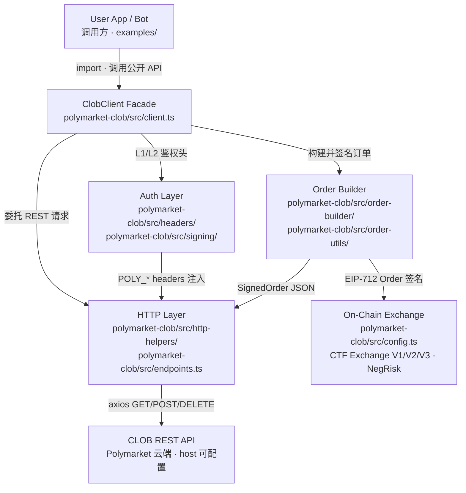

# Polymarket CLOB Client — 顶层架构

> submodule: `polymarket-clob/` · upstream: `@polymarket/clob-client-v2` · archived 2026-06-11

## 总结

**最关键的一个抽象**是 `ClobClient` 这一层 Facade：它把「链下 REST 交互」和「链上订单签名」两条完全不同的协议栈，收敛成同一个 TypeScript 对象上的方法调用（如 `createOrDeriveApiKey`、`createAndPostOrder`）。调用方只需注入 `host`、`chain`、`signer`、`creds`，不必自己拼装 70+ 条路由、EIP-712 domain、HMAC 头或 Exchange 版本差异。

**工程上的巧思**在于双层鉴权 + 职责切分：L1 用钱包 EIP-712 一次性换取 API Key，L2 用 HMAC 给每个受保护请求签名——这样高频交易不必反复弹钱包，同时链上身份与 API 凭证仍绑定。订单侧则把「业务计算」（`order-builder/helpers/` 里的价格、数量、舍入）与「协议编码」（`order-utils/` 里 V1/V2/V3 Exchange ABI 与 TypedData）分开，再让 `headers/` 与 `http-helpers/` 只管传输。新手可学到的设计点是：**用 Facade 隐藏多协议复杂度，用分层让每一层只回答一个问题（算什么、签什么、发什么）**——比把所有逻辑堆进一个 1700 行的文件更可测、可替换，也比过早抽象出通用框架更务实。
