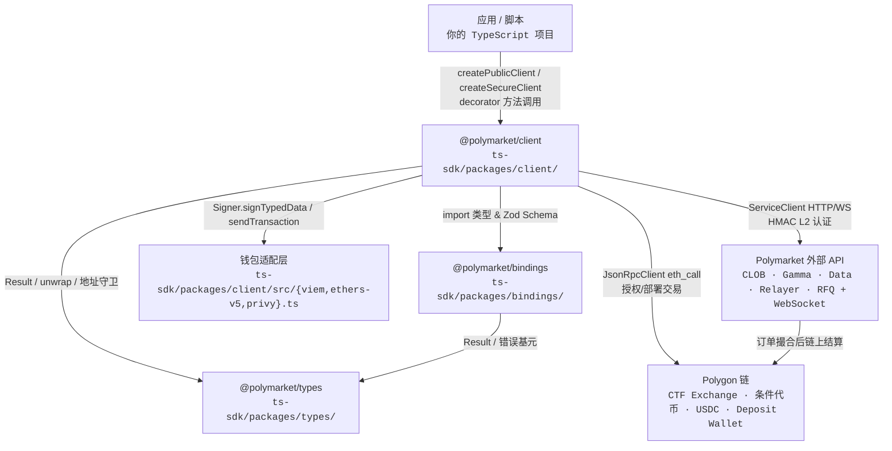

# Polymarket TS SDK 调研报告

> 调研对象：`ts-sdk/`（Polymarket 官方 TypeScript SDK，pnpm monorepo）  
> 参考：`ts-sdk-architecture.html`、源码 `packages/{client,bindings,types}/`

---

## Step 1 — 顶层架构



### 文字总结

**最关键的一个抽象：`Signer` + `AsyncGenerator` 工作流（Workflow）。**  
SDK 不把「调 API」和「弹钱包签名」混写成一坨 async/await，而是把需要用户交互的步骤拆成 `yield signOrder(...)` / `yield sendTransaction(...)` 的生成器，再由 `completeWith(signer)` 统一驱动。业务函数（如 `prepareLimitOrder`）只描述「要签什么」，不关心底层是 viem、ethers 还是 Privy。

**工程上的巧思：装饰器 + 无状态 Action 的双层 API。**  
对外是 `client.placeLimitOrder(...)` 这种面向对象的体验；对内是每个 action 都接收 `client` 作为第一个参数的无状态纯函数（`placeLimitOrder(client, request)`），通过 `tradingActions` 装饰器 `bind(null, client)` 挂到 client 实例上。这样既保留了 viem 风格的 composability（高级用户可以只 import action），又让新手有一条清晰的「创建 client → 调方法」路径。再配合 `bindings` 包里自动生成的 Zod Schema，在边界处统一做运行时校验，把 HTTP 脏数据挡在 SDK 外面。

---

## Step 2 — 完整执行链路：`placeLimitOrder`（提交限价单）

> 用户动作：已认证的 `SecureClient` 上调用  
> `client.placeLimitOrder({ tokenId, price, size, side, postOnly? })`  
> 目标：生成 EIP-712 签名订单 → 提交 CLOB →（必要时）链上授权 → 订单进入撮合引擎。

### 主路径（Happy Path）

1. 用户输入 `PrepareLimitOrderRequest` 对象（tokenId / price / size / side 等）
   → `ts-sdk/packages/client/src/decorators/trading.ts`: `placeLimitOrder`（bound 方法）

2. 装饰器转调无状态 action
   → `ts-sdk/packages/client/src/actions/orders/trade.ts`: `placeLimitOrder`

3. 先签名、再投递
   → `ts-sdk/packages/client/src/actions/orders/trade.ts`: `createLimitOrder`

4. 启动限价单工作流（返回 AsyncGenerator）
   → `ts-sdk/packages/client/src/actions/orders/prepare.ts`: `prepareLimitOrder`

5. Zod 校验用户入参
   → `ts-sdk/packages/client/src/input.ts`: `parseUserInput`（schema: `PrepareLimitOrderParamsSchema` in `limit.ts`）

6. 拉取市场上下文、计算 maker/taker 金额
   → `ts-sdk/packages/client/src/actions/orders/limit.ts`: `prepareLimitOrderDraft`
   → **【异步 / 跨进程】** `ts-sdk/packages/client/src/actions/clob.ts`: `fetchTickSize`（HTTP GET `/tick-size`）
   → **【异步 / 跨进程】** `ts-sdk/packages/client/src/actions/clob.ts`: `fetchNegRisk`（HTTP GET `/neg-risk`）
   → `ts-sdk/packages/client/src/actions/orders/context.ts`: `resolveExchangeAddress`

7. 构造未签名订单（含 salt、timestamp、maker/signer 身份）
   → `ts-sdk/packages/client/src/actions/orders/orders.ts`: `createUnsignedOrder`
   → `ts-sdk/packages/client/src/wallet.ts`: `resolveOrderIdentity`

8. 构造 EIP-712 TypedData，yield 给工作流驱动器
   → `ts-sdk/packages/client/src/actions/orders/typed-data.ts`: `createOrderTypedDataPayload`
   → `ts-sdk/packages/client/src/exchange.ts`: `createExchangeOrderTypedDataPayload`
   → `ts-sdk/packages/client/src/actions/orders/types.ts`: `signOrder`

9. 驱动工作流：调用钱包签名
   → `ts-sdk/packages/client/src/workflow.ts`: `completeWith` → 内部 `signer.signTypedData`
   → `ts-sdk/packages/client/src/viem.ts`: `signerFrom` 返回的 `signTypedData`（或 ethers-v5 / privy 适配器）

10. 组装最终签名（含 POLY_1271 智能钱包包装）
    → `ts-sdk/packages/client/src/actions/orders/typed-data.ts`: `createOrderSignature`
    → `ts-sdk/packages/client/src/actions/orders/orders.ts`: `createSignedOrder`

11. 回到 trade 层，投递已签名订单
    → `ts-sdk/packages/client/src/actions/orders/trade.ts`: `postOrderWithAllowanceRecovery`
    → `ts-sdk/packages/client/src/actions/orders/post.ts`: `postOrder` → 内部 `postSignedOrder`

12. 序列化 payload（salt 转 number、附 owner API key）
    → `ts-sdk/packages/client/src/actions/orders/post.ts`: `createSendOrderPayload`

13. 带 L2 HMAC 头发送 HTTP POST
    → `ts-sdk/packages/client/src/clients.ts`: `BaseSecureClient.#createL2Headers`
    → `ts-sdk/packages/client/src/hmac.ts`: `buildHmacSignature`
    → `ts-sdk/packages/client/src/ServiceClient.ts`: `ServiceClient.post`
    → **【异步 / 跨进程】** `POST https://clob.polymarket.com/order`

14. 校验响应 JSON
    → `ts-sdk/packages/client/src/response.ts`: `validateWith`（`OrderResponseSchema` from bindings）

15. **【底层写入 — CLOB 服务端】** Polymarket CLOB 验证 EIP-712 签名与 allowance 缓存后，将订单写入链下订单簿（撮合引擎 DB）。此步是 `placeLimitOrder` 的直接终点。

16. **【延迟链上写入 — 不在本次调用同步发生】** 当订单被撮合时，CTF Exchange 合约在 Polygon 上结算代币/USDC 转移。

### 异常分支：allowance 不足自动恢复

主路径第 11 步 `postSignedOrder` 若抛出 `RequestRejectedError`（HTTP 400，消息含 `allowance is not enough`）：

A1. 识别可恢复错误
   → `ts-sdk/packages/client/src/actions/orders/trade.ts`: `isBalanceOrAllowanceRequestRejection`

A2. 查 neg-risk、exchange 地址、当前 allowance
   → `ts-sdk/packages/client/src/actions/orders/trade.ts`: `ensureOrderApproval`
   → `ts-sdk/packages/client/src/actions/clob.ts`: `fetchNegRisk`
   → `ts-sdk/packages/client/src/actions/orders/allowance.ts`: `resolveCurrentAllowance`
   → **【异步 / 跨进程】** `JsonRpcClient` → Polygon RPC `eth_call`（读 ERC-20 allowance 或 ERC-1155 isApprovedForAll）

A3. 若链上 allowance 确实不足，发起授权交易
   - BUY 侧 → `ts-sdk/packages/client/src/actions/approvals.ts`: `approveErc20`
   - SELL 侧 → `ts-sdk/packages/client/src/actions/approvals.ts`: `approveErc1155ForAll`
   → `workflow.ts`: `completeWith` → `signer.sendTransaction`
   → **【异步 / 跨进程】** Polygon 链上写入 `approve` 交易

A4. 等待交易确认
   → `TransactionHandle.wait()`（viem `waitForTransactionReceipt`）

A5. 通知 CLOB 刷新余额/allowance 缓存
   → `ts-sdk/packages/client/src/actions/account.ts`: `updateBalanceAllowance`
   → **【异步 / 跨进程】** `GET /balance-allowance/update`

A6. 重试投递
   → `post.ts`: `postSignedOrder`（同主路径第 11–15 步）

若 A2 发现 allowance 已够（CLOB 缓存滞后），或 A3 用户拒绝签名 / 交易失败 → 抛出原始 `RequestRejectedError`，链路终止。

### 其他常见异常分支（主路径各步均可能触发）

| 阶段 | 触发条件 | 落点函数 | 错误类型 |
|------|----------|----------|----------|
| 入参校验 | price 不符合 tick / expiration < 60s | `parseUserInput` / `resolvePrice` | `UserInputError` |
| 拉市场数据 | CLOB 限流 / 网络失败 | `fetchTickSize` / `fetchNegRisk` | `RateLimitError` / `TransportError` |
| 钱包签名 | 用户拒绝 | `completeWith` → `workflow.throw` | `CancelledSigningError` |
| 投递订单 | 签名无效 / 余额不足（非 allowance） | `postSignedOrder` | `RequestRejectedError` |
| 响应畸形 | JSON 不符合 Schema | `validateWith` | `UnexpectedResponseError` |

### 结论：最关键的一跳

**第 8–10 步：EIP-712 订单签名（`createOrderTypedDataPayload` → `completeWith` → `createOrderSignature`）。**

原因：CLOB 是「链下订单簿 + 链上结算」架构，订单能不能被接受，取决于 TypedData 的 domain（exchange 合约地址、chainId）、字段编码（尤其是 salt 必须 ≤ 53 bit 以匹配 JSON number 线格式）、以及 POLY_1271 智能钱包的签名包装是否与合约验证逻辑一致。HTTP 投递、HMAC 认证、allowance 恢复都是「签名正确」之后的工程问题；签名错了，后面全部无效。

---

## Step 3 — 跨文件依赖分析：`createOrderTypedDataPayload`

分析对象：`ts-sdk/packages/client/src/actions/orders/typed-data.ts` → `createOrderTypedDataPayload`

### 1. 它直接 import / require 了哪些东西？

| 来源 | 引入内容 | 用途 |
|------|----------|------|
| `@polymarket/types` | `Erc1271Signature`, `EvmSignature` | 签名类型标注（用于 `createOrderSignature` 返回值） |
| `../../exchange` | `createExchangeOrderSignature`, `createExchangeOrderTypedDataPayload`, `ExchangeOrderProtocolVersion` | 底层 EIP-712 构造与 1271 包装 |
| `../../types` | `TypedDataPayload` | 返回类型 |
| `./types` | `UnsignedOrder` | 入参：未签名订单结构 |

函数体仅做一件事：从 `UnsignedOrder` 提取 `chainId` / `exchangeAddress`，固定 `protocolVersion: V2`，委托给 `createExchangeOrderTypedDataPayload`。

### 2. 它被项目里哪些地方调用 / 引用？

| 调用方 | 函数 / 场景 |
|--------|-------------|
| `actions/orders/prepare.ts` | `prepareMarketOrder` 工作流内 `yield signOrder(createOrderTypedDataPayload(unsignedOrder))` |
| `actions/orders/prepare.ts` | `prepareLimitOrder` 工作流内（同上） |
| `actions/orders/typed-data.test.ts` | 单元测试 |

间接调用链（通过 `prepareLimitOrder` / `prepareMarketOrder`）：

- `actions/orders/trade.ts` → `createLimitOrder` / `createMarketOrder`
- `decorators/trading.ts` → `tradingActions` 绑定到 client
- 集成测试 `tests/integration/orders.test.ts`

**未被 CLOB 下单以外的路径直接调用**；RFQ 报价签名走平行路径 `websockets/rfq/signing.ts` → 直接调 `createExchangeOrderTypedDataPayload`（见第 4 问对比）。

### 3. 若把它的入参 / 返回值 / 行为改成 Y，会有哪些地方需要同步改？

假设改动类型与影响面：

| 改动 Y | 需同步修改的位置 |
|--------|------------------|
| 入参从 `UnsignedOrder` 改为更窄/更宽的结构 | `prepare.ts`（两处调用）、`typed-data.test.ts`；若新字段来自 draft，还需改 `orders.ts:createUnsignedOrder` |
| 返回值 `TypedDataPayload` 的 `primaryType` / `types` 结构变化 | `workflow.ts:completeWith`（`signOrder` 分支）、所有 `Signer` 实现（`viem.ts` / `ethers-v5.ts` / `privy.ts`）、`exchange.ts` 哈希逻辑 |
| `protocolVersion` 从 V2 改为 V3 | `createOrderExchangeDomain`、`exchange.ts` domain separator；`context.ts:resolveExchangeAddress` 可能需对齐 v3 exchange 地址；RFQ 已在用 V3，可参考 `signing.ts` |
| 签名后处理逻辑变化（`createOrderSignature`） | `prepare.ts` 中 `createOrderSignature` 调用、`post.ts:createSendOrderPayload`（wire format）、CLOB 服务端验证（SDK 外） |
| 支持新的 `SignatureType` | `exchange.ts:createExchangeOrderTypedDataPayload` 分支、`wallet.ts:resolveOrderIdentity`、`typed-data.ts` 全流程 |

原则：**这是「订单签名」与「钱包接口」的接缝**，任何 TypedData 形状变化都会穿透工作流层和所有 Signer 适配器。

### 4. 项目里有没有类似设计的另一个函数？差异对比

**对照：`websockets/rfq/signing.ts` → `signRfqQuoteOrder`**

| 维度 | `createOrderTypedDataPayload`（CLOB 订单） | `signRfqQuoteOrder`（RFQ 报价） |
|------|---------------------------------------------|----------------------------------|
| 封装层级 | 薄包装：Order 模块专用，固定 V2 domain | 厚逻辑：自行拼 order 字段 + 调底层 exchange 函数 |
| Domain 来源 | 从 `UnsignedOrder.chainId` + `exchangeAddress` 推导 | 调用方传入 `exchange` + `chainId`，使用 **V3** |
| 工作流集成 | 通过 `yield signOrder` + `completeWith`，支持取消/重入 | 直接 `await signer.signTypedData`，不走 AsyncGenerator |
| 订单构造 | 上游 `createUnsignedOrder` 统一生成 | 函数内联计算 makerAmount/takerAmount |
| salt 生成 | `orders.ts:generateOrderSalt`（53-bit 上限） | 本地 `generateOrderSalt`（RFQ 独立实现） |
| 签名包装 | `createOrderSignature` → `createExchangeOrderSignature` | 同样调用 `createExchangeOrderSignature`，但 domain 不同 |
| 下游消费 | HTTP `POST /order` | WebSocket RFQ quoter 消息 |

**共同点：** 都依赖 `exchange.ts` 作为 EIP-712 的单一真相源（Single Source of Truth），避免在业务层手写 struct hash。

**差异启示：** CLOB 路径更强调工作流可组合；RFQ 路径更强调低延迟直连签名。底层 exchange 模块被两条产品线复用，只是 protocol version 和 domain 构造方式不同。

---

## Step 4 — 可借鉴到自己 Web3 项目的 3 个设计点

### 设计点 1：AsyncGenerator 工作流 + `completeWith(signer)` 解耦交互

**解决的问题：** Web3 SDK 里大量操作需要「若干步链上/链下调用中间插入钱包弹窗」，若全写在一个 async 函数里，难以测试、难以换钱包、难以在 CLI 与浏览器复用。

**怎么落地到新项目：**

1. 定义 `WorkflowRequest` 联合类型（`signTypedData` / `sendTransaction` / `requestAddress`）。
2. 业务函数写成 `async function* workflow(): AsyncGenerator<Request, Result, Response>`，在需要签名处 `yield { kind: 'signOrder', payload }`。
3. 提供单一驱动器 `completeWith(signer)` 循环 `next()` / 分发到 signer。
4. 纯函数测试时注入 mock signer，无需真实钱包。

**本项目代码位置：**

- `ts-sdk/packages/client/src/workflow.ts` — `completeWith`, `authenticateWith`
- `ts-sdk/packages/client/src/actions/orders/prepare.ts` — `prepareLimitOrder` 工作流示例

---

### 设计点 2：三层包职责分离 — types / bindings / client

**解决的问题：** API 响应字段漂移、类型与运行时校验脱节、client 代码膨胀。

**怎么落地到新项目：**

1. **`types` 包**：跨包共用的 `Result`、`EvmAddress` 守卫、错误基类（无业务）。
2. **`bindings` 包**：从 OpenAPI / 内部 spec **生成** Zod Schema + 品牌 ID（`TokenId`、`MarketId`），每个微服务一个子路径（`./clob`, `./gamma`）。
3. **`client` 包**：只写编排逻辑；HTTP 返回必经 `validateWith(Schema)`；用户输入必经 `parseUserInput(Schema)`。

**本项目代码位置：**

- `ts-sdk/packages/types/src/result.ts` — `unwrap` 封装 neverthrow
- `ts-sdk/packages/bindings/src/clob/` — 自动生成 Schema
- `ts-sdk/packages/client/src/response.ts` — `validateWith`
- `ts-sdk/packages/client/src/input.ts` — `parseUserInput`

---

### 设计点 3：无状态 Action + Decorator 挂载，兼顾可组合与易用

**解决的问题：** 高级用户想 `import { placeLimitOrder } from '@my-sdk/actions'` 组装自定义流程；新手只想 `client.placeLimitOrder()`。

**怎么落地到新项目：**

1. 每个能力实现为 `(client, params) => Promise<T>`，client 携带环境、认证、HTTP 客户端。
2. `createXxxClient()` 返回裸实例，用 `extend(decorator)` 或 `Object.assign(client, tradingActions(client))` 挂载方法。
3. 装饰器只做 `fn.bind(null, client)`，不写业务逻辑。
4. 导出 action 函数供 tree-shaking 友好的高级用法。

**本项目代码位置：**

- `ts-sdk/packages/client/src/actions/orders/trade.ts` — 无状态 `placeLimitOrder`
- `ts-sdk/packages/client/src/decorators/trading.ts` — `tradingActions` 绑定
- `ts-sdk/packages/client/src/clients.ts` — `BaseSecureClient.extend`, `createSecureClient`

---

## 附录：Monorepo 目录速查

```
ts-sdk/
├── packages/
│   ├── client/     # 主 SDK：actions、decorators、workflow、HTTP/WS/RPC
│   ├── bindings/   # 自动生成 API 类型 + Zod Schema
│   └── types/      # Result、地址/签名守卫、共享错误
├── examples/       # 示例脚本
└── pnpm-workspace.yaml
```
