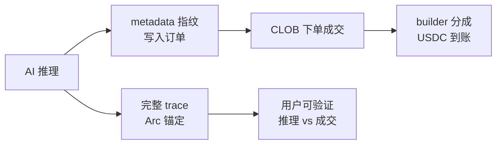

# Trace2Trade 核心概念：metadata 推理指纹 + builder 分成 + Arc trace

> 对应 [hackathon-ideas.md](./hackathon-ideas.md) Idea 1 — Trace2Trade  
> 创建日期：2026-06-12

---

## 整体关系（一句话）

Agent 分析市场 → 把推理摘要写进订单 `metadata`（指纹）→ 用 `builderCode` 标记来源以便平台分成 → 把完整推理 trace 锚定到 Arc 链上供事后审计。



---

## 1. metadata 推理指纹

### 是什么

Polymarket V2 订单在 EIP-712 签名里有一个 **`metadata` 字段（bytes32）**，最多 32 字节。

「推理指纹」= 把 Agent 的结构化推理 JSON 做 **keccak256 哈希**，得到 32 字节 hex，写进这个字段。

订单上链/进 CLOB 后，任何人都能验证：**「这笔单的 metadata，是否对应某份推理内容？」**

### 推理 JSON 示例

```json
{
  "agent": "trace2trade-v1",
  "market": "Will the Fed cut rates in March 2026?",
  "direction": "YES",
  "confidence": 0.72,
  "fairValue": 0.58,
  "sources": ["CME FedWatch", "Reuters headline hash abc123"],
  "reasoningId": "run-2026-06-12-001",
  "timestamp": 1718123456
}
```

### 指纹怎么算

```text
metadata = keccak256(JSON.stringify(推理对象))
         = 0x8f3a...c2b1   // 32 字节，正好塞进 bytes32
```

### 举例

1. Agent 判断「Fed 3 月降息」公允价 58%，建议买 YES @ 0.55
2. 生成上述 JSON → 哈希 → `metadata = 0x8f3a...`
3. 调用 ts-sdk 下单（概念上）：

```ts
await client.placeLimitOrder({
  tokenId: '12345...',
  price: 0.55,
  size: 100,
  side: OrderSide.BUY,
  builderCode: '0xYourBuilderCode...',
  // metadata 需写入订单 draft（V2 协议支持；当前 ts-sdk beta 默认填零，产品化时需扩展）
});
```

4. 订单成交后，follower 拿到完整 JSON，本地再算一遍 hash，和链上/CLOB 订单里的 `metadata` 对比
   - 一致 → 证明「这笔成交确实来自这份推理」
   - 不一致 → 说明 Agent 造假或版本对不上

**类比：** 像 Git commit hash — 链上只存 hash，完整内容另存（见第 3 节 Arc trace）。

---

## 2. builder 分成

### 是什么

Polymarket V2 的 **Builder Program**：你在 Polymarket 注册 Builder Profile，拿到一个 **`builderCode`**。

用户通过你的 Agent/界面下单，并在订单里带上这个 code，平台会把一部分 **taker/maker fee 分给 Builder**（USDC，无需发 token、无需托管用户资金）。

Canteen 研究里的说法：**"Builder codes as every LLM agent's monetization layer"** — Agent 的商业模式从「订阅/打赏」变成「成交即分成」。

### 资金流举例

| 角色 | 动作 |
|------|------|
| 用户 Alice | 在 Trace2Trade 跟单，买 100 USDC 的 YES |
| Trace2Trade Agent | 生成推理 + 下单，带 `builderCode: 0xABC...` |
| Polymarket CLOB | 撮合成交，收取平台 fee（例如 1%） |
| 平台 | 按 Builder 规则，把其中一部分（例如 taker fee 的 50%）打给 Trace2Trade 的 Builder 钱包 |
| Trace2Trade | 用 `client.listBuilderTrades({ builderCode })` 拉归因成交，Dashboard 展示收入和 PnL |

**具体数字（示意）：**

```text
Alice 成交 notional:     $100
平台 taker fee:          $1.00
Builder 分成 (假设 50%):  $0.50 → Trace2Trade 钱包
```

若一个月有 200 个 follower、人均跟单 $500 → 归因 volume $100k → Builder 分成可能 $500+，且随 volume 线性增长，**不依赖订阅**。

### 和 metadata 的分工

| 字段 | 作用 |
|------|------|
| `metadata` | 证明「这笔单对应哪份推理」（可验证性） |
| `builderCode` | 证明「这笔单从哪个 Agent 来」（分钱归因） |

两者可以同时出现在同一笔订单里。

---

## 3. Arc trace

### 是什么

[Agora Agents Hackathon](https://agora.thecanteenapp.com/) 由 Circle 主办，鼓励用 **Arc L1** 做结算/存证层：

- 亚秒级确认
- 每笔 tx 约 **$0.01 USDC**（不用 volatile gas token）
- 适合高频、小额的链上锚定

**Arc trace** = 把 Agent 的**完整推理过程**（不是 32 字节的 hash）存到 Arc 上，形成不可篡改的审计记录。

### 和 metadata 的区别

| | metadata（订单内） | Arc trace（链上） |
|--|-------------------|------------------|
| 容量 | 仅 32 字节（只能存 hash） | 可存 hash + 指向完整内容 |
| 位置 | Polymarket 订单 / CLOB | Arc 链 |
| 用途 | 快速验证「单 ↔ 推理」 | 长期审计、付费解锁 trace、社交跟单信誉 |

### 存什么

完整 trace 通常包括：

```json
{
  "runId": "run-2026-06-12-001",
  "metadataHash": "0x8f3a...c2b1",
  "orderHash": "0xdef...",
  "steps": [
    { "role": "Researcher", "output": "FedWatch 隐含概率 62%..." },
    { "role": "Trader", "output": "Buy YES @ 0.55, Kelly 3%" },
    { "role": "Risk", "output": "Approved, max $100" }
  ],
  "model": "claude-sonnet-4",
  "latencyMs": 4200
}
```

### Arc 上怎么锚（两种常见做法）

**做法 A — 只锚 hash（最便宜）**

```text
Arc tx payload: { metadataHash: 0x8f3a..., orderHash: 0xdef..., timestamp }
费用: ~$0.01
```

**做法 B — hash + IPFS/Arc 存储指针**

```text
1. 完整 JSON 上传 IPFS → 得 CID
2. Arc tx 写入: { metadataHash, ipfsCid: "Qm...", orderHash }
3. 用户用 CID 拉完整 trace，再验证 hash 与订单 metadata 一致
```

### 举例（完整时间线）

```text
T+0s   Agent 分析 Fed 市场，生成推理 JSON
T+1s   metadataHash = keccak256(JSON)
T+2s   完整 trace 上传 IPFS → CID = QmXyz...
T+3s   Arc 写入: { metadataHash, ipfsCid, agentId }  // ~$0.01
T+5s   placeLimitOrder(metadata=metadataHash, builderCode=0xABC...)
T+30s  订单成交
T+31s  Dashboard 展示三联对照:
       Arc trace ←→ metadata hash ←→ listBuilderTrades 成交记录
```

Follower 看到：

- Arc 上 6 月 12 日 10:00 的 trace
- 同一时刻 CLOB 有一笔 metadata 匹配的 YES 买单
- Builder 面板显示这笔归因成交 + 分成 $0.50

→ **推理、下单、赚钱、可审计** 四条线闭环。

---

## 端到端故事（用户视角）

**Bob** 订阅了 Trace2Trade，跟踪其 Fed 利率 Agent。

1. Agent 读到「非农超预期」，推理「降息概率下降」，建议卖 YES @ 0.62
2. 推理 JSON → `metadata = 0x8f3a...`
3. 完整 4 步推理 trace → IPFS → Arc 锚定（$0.01）
4. Bob 一键跟单，订单带 Trace2Trade 的 `builderCode`
5. 成交后 Bob 在 Dashboard 看到完整推理；本地验证 hash 与订单一致
6. Trace2Trade 收到 builder 分成；Bob 可对比「历史 trace 准确率 vs 实际 PnL」决定是否继续跟

---

## 实现注意（基于当前 ts-sdk）

- **`builderCode`**：ts-sdk 已支持，`placeLimitOrder({ builderCode })` 即可
- **`metadata`**：V2 订单协议和 EIP-712 已包含该字段，但当前 ts-sdk 在 `createUnsignedOrder` 里**默认填零**；做 Trace2Trade 需在 SDK 层扩展传入 metadata，或走更低层 order 构造
- **Arc trace**：Hackathon 侧能力，用 Circle Arc CLI / 合约写入；与 Polymarket 下单是两条链，通过 `metadataHash` 关联

---

## 为什么这三件事要绑在一起

| 单独做 | 缺什么 |
|--------|--------|
| 只有 metadata | Agent 赚不到钱，没人持续维护 |
| 只有 builder 分成 | 无法证明推荐质量，跟单变成盲跟 |
| 只有 Arc trace | 和 Polymarket 成交脱节，无法链上归因到具体订单 |

三者组合 = **可验证的 AI 推荐 + 可持续的 Agent 收入 + 可审计的完整推理**，这也是 Agora 评审里 Agentic（30%）+ Innovation（20%）+ Traction（30%）的叠加点。

---

## 参考资料

- [hackathon-ideas.md](./hackathon-ideas.md) — Trace2Trade 方案全文
- [Agora Agents Hackathon](https://agora.thecanteenapp.com/)
- [Unbundling the Prediction Market Stack (Canteen)](https://thecanteenapp.com/analysis/2026/05/01/unbundling-the-prediction-market-stack.html)
- [Polymarket/ts-sdk](https://github.com/Polymarket/ts-sdk)
- [ts-sdk-research.md](../day1-onchain-hello/spec/ts-sdk-origin-doc/ts-sdk-research.md)
