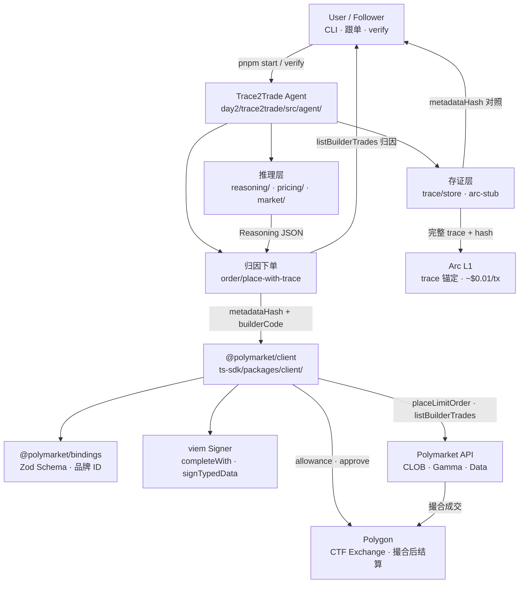
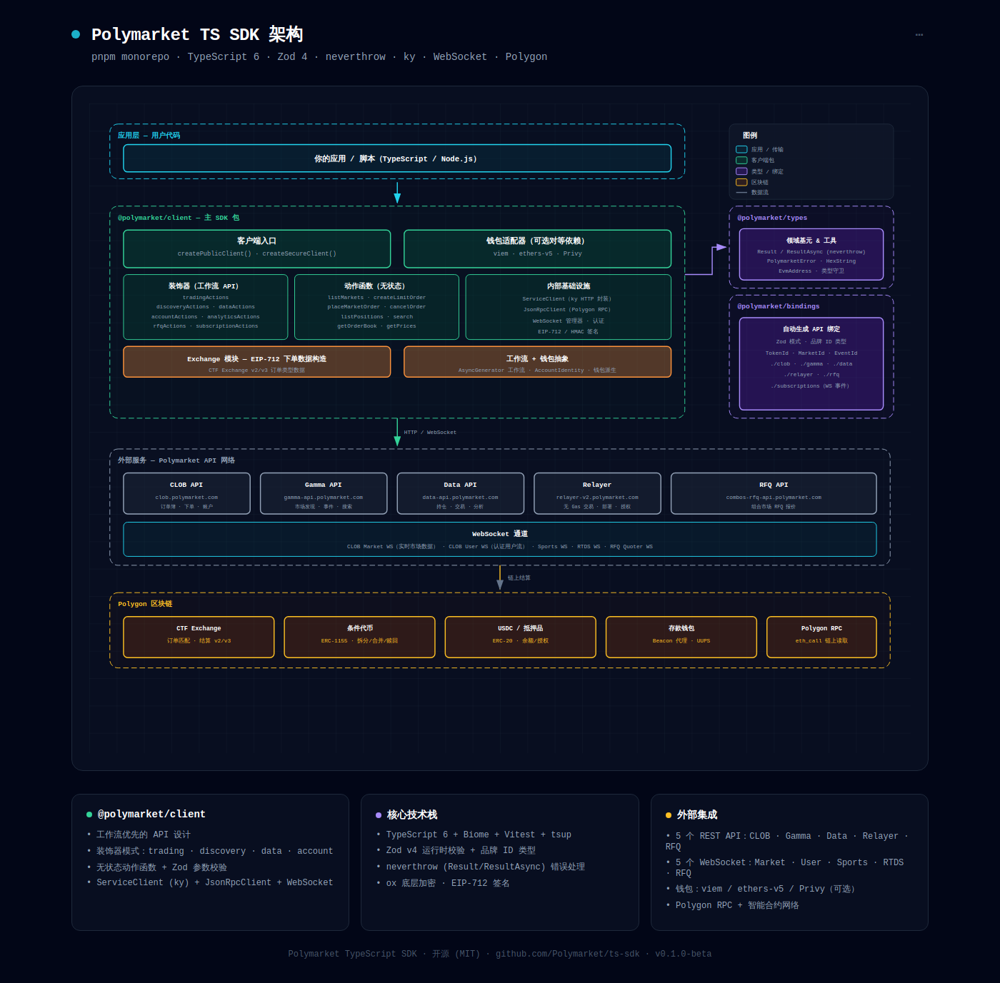

# Project Notes · Trace2Trade

> Source: https://github.com/Polymarket/ts-sdk · [hackathon-ideas.md](../day2/hackathon-ideas.md) Idea 1 · [trace2trade-concepts.md](../day2/trace2trade-concepts.md)
> Read on: 2026-06-12

## 1. 项目在做什么（一句话）

可验证推理指纹写入订单并获 Builder 分成

## 2. 顶层架构图

### ts-sdk 底层架构（Trace2Trade 依赖层）

Trace2Trade 的 `Order` 模块通过 `@polymarket/client` 调用 Polymarket；下图展示该 SDK 的内部分层与外部集成边界。

交互式完整版：[ts-sdk-architecture.html](../day1-onchain-hello/spec/ts-sdk-origin-doc/ts-sdk-architecture.html)  
源码调研：[ts-sdk-research.md](../day1-onchain-hello/spec/ts-sdk-origin-doc/ts-sdk-research.md) · 上游仓库：[Polymarket/ts-sdk](https://github.com/Polymarket/ts-sdk)

上图展示 ts-sdk monorepo 分层：**应用层** 经 `createPublicClient` / `createSecureClient` 调用 **@polymarket/client**（装饰器 + 无状态 Action + AsyncGenerator 工作流）；client 依赖 **@polymarket/bindings**（Zod Schema）与 **@polymarket/types**（Result / 地址守卫）；向下经 **viem Signer** 完成 EIP-712 签名，经 **ServiceClient** 对接 CLOB · Gamma · Data · Relayer · RFQ WebSocket，经 **JsonRpcClient** 读写 Polygon 链。Trace2Trade 的 `place-with-trace.ts` 落在应用层与 client 的接缝——在 `createUnsignedOrder` 注入 metadata 后，仍走同一套 `completeWith` → `postOrder` 链路。

## 3. 核心模块表

| 模块 | 路径 | 职责 | 关键文件 |
|---|---|---|---|
| Agent 主循环 | `day2/trace2trade/src/agent/` | 编排 discover → reason → order → trace 一轮闭环 | `engine.ts` |
| 推理 & 指纹 | `day2/trace2trade/src/reasoning/` | 结构化 Reasoning JSON；keccak256 → metadata bytes32 | `schema.ts`, `fingerprint.ts` |
| 市场发现 | `day2/trace2trade/src/market/` | Fed 关键词搜市场；读订单簿 midpoint / 深度 | `discovery.ts`, `orderbook.ts` |
| 定价引擎 | `day2/trace2trade/src/pricing/` | 规则引擎 fair value + 方向（MVP 不用 LLM） | `fair-value.ts` |
| 归因下单 | `day2/trace2trade/src/order/` | 注入 metadata + builderCode；封装 placeLimitOrder | `place-with-trace.ts` |
| Trace 存证 | `day2/trace2trade/src/trace/` | 本地 JSON 存完整 trace；Arc 锚定 stub | `store.ts`, `arc-stub.ts` |
| 验证脚本 | `day2/trace2trade/src/scripts/` | metadataHash ↔ Reasoning JSON 三联对照 | `verify-trace.ts` |
| ts-sdk Client | `ts-sdk/packages/client/` | 统一 CLOB/Gamma/Data；workflow 驱动签名 | `clients.ts`, `decorators/trading.ts` |
| ts-sdk Workflow | `ts-sdk/packages/client/src/` | AsyncGenerator + completeWith 解耦钱包交互 | `workflow.ts`, `actions/orders/prepare.ts` |
| ts-sdk Bindings | `ts-sdk/packages/bindings/` | 自动生成 Zod Schema；运行时校验 HTTP 响应 | `src/clob/`, `src/gamma/` |

## 4. 关键路径示例

用户动作：Agent 对 Fed 利率市场跑一轮「推理 → 指纹下单 → 存证 → 可验证」（Paper 或 Live）

| 步骤 | 描述 | 文件 / 函数 |
|---|---|---|
| 1 | 搜索 Fed 相关市场，取 YES tokenId | `market/discovery.ts` · `client.listMarkets` / `search` |
| 2 | 读订单簿 midpoint，规则引擎输出 fair value + 方向 | `orderbook.ts`, `pricing/fair-value.ts` |
| 3 | 生成结构化 Reasoning JSON | `reasoning/schema.ts` |
| 4 | keccak256(JSON) → metadataHash（32 字节指纹） | `reasoning/fingerprint.ts` |
| 5 | 完整 trace 写本地；Arc stub 锚定 hash + runId | `trace/store.ts`, `trace/arc-stub.ts` |
| 6 | 构造订单 draft，注入 metadata + builderCode | `order/place-with-trace.ts` · 扩展 `createUnsignedOrder` |
| 7 | 启动限价单工作流，yield EIP-712 签名请求 | `ts-sdk/.../prepare.ts` · `prepareLimitOrder` |
| 8 | **核心**：completeWith 驱动钱包 signTypedData | `ts-sdk/workflow.ts` · `completeWith` → `viem.ts` |
| 9 | 组装 SignedOrder，L2 HMAC POST 提交 CLOB | `ts-sdk/.../trade.ts` · `postOrderWithAllowanceRecovery` |
| 10 | （allowance 不足时）链上 approve → 刷新缓存 → 重试 | `ts-sdk/.../approvals.ts`, `account.ts` |
| 11 | CLOB 写入订单簿；撮合后 Polygon 链上结算（异步） | Polymarket 服务端 / CTF Exchange |
| 12 | listBuilderTrades 拉归因成交；verify 对照三联 | `client.listBuilderTrades` · `scripts/verify-trace.ts` |

**结论**：最关键两跳是 Step 4（metadata 指纹绑定推理）和 Step 8（EIP-712 签名）——前者让「推荐可验证」，后者让「订单被 CLOB 接受」；builderCode 则把归因成交变成 Agent 的 USDC 收入。

## 5. 3 个可借鉴的设计点

1. **metadata + builder 双字段分工**：metadata（bytes32）存推理 keccak256 指纹，证明「这笔单对应哪份推理」；builderCode 做平台 fee 归因，证明「这笔单从哪个 Agent 来」并持续分成。借鉴到自己项目时，不要把「可验证性」和「商业化」混成一个字段——hash 给 follower 验真，builder 给开发者收钱；Trace2Trade 在 `place-with-trace.ts` 一次下单同时写入两者，Dashboard 用 `listBuilderTrades` 展示收入侧、用 verify 脚本展示信任侧。

2. **AsyncGenerator 工作流 + `completeWith(signer)`**：ts-sdk 把「调 API」和「弹钱包签名」拆开——业务函数 `prepareLimitOrder` 只 `yield signOrder(payload)`，驱动器 `completeWith` 统一循环分发到 viem/ethers/Privy。借鉴到 Trace2Trade 时，Agent 主循环只管推理与决策，签名/授权步骤注入 mock signer 即可 Paper 跑通，Live 时换真实 signer，CLI 与后续 React 前端复用同一 workflow。代码：`ts-sdk/packages/client/src/workflow.ts`, `actions/orders/prepare.ts`。

3. **双层存证：订单内 hash + Arc 完整 trace**：metadata 只有 32 字节，只能存 keccak256；完整多步推理（Researcher / Trader / Risk）存本地 JSON + IPFS CID，再用 Arc（~$0.01/tx）锚定 `{ metadataHash, ipfsCid, orderHash }`。借鉴时把「链上/订单上的轻量指纹」和「链下的重量内容」分层——验证路径是：拿 JSON → 算 hash → 对比订单 metadata → 对比 Arc 锚定记录，类似 Git commit + remote 的三方对照。

## 6. 我的疑问 / 不确定的点

1. **Builder Code 注册流程与分成比例。** `builderCode` 在 ts-sdk 已支持传入，但注册 Builder Profile、实际 taker/maker 分成 bps、结算周期——还没在 Live 环境验证过，Paper 阶段只能模拟 builder 字段存在。
2. **规则引擎 vs LLM 的 Agentic 评分。** MVP 用 midpoint + 深度做 fair value，无 LLM 外部 API；Agora 评审 Agentic 占 30%——纯规则引擎是否会被认为「AI 决策不足」，还是 structured reasoning + 自主下单闭环已足够？
