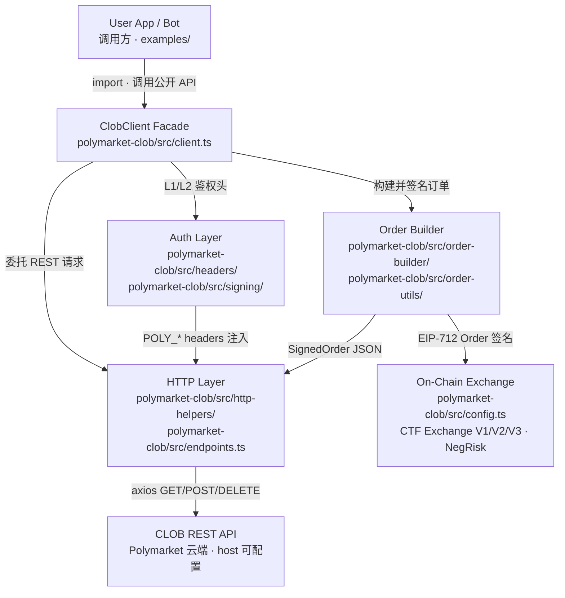
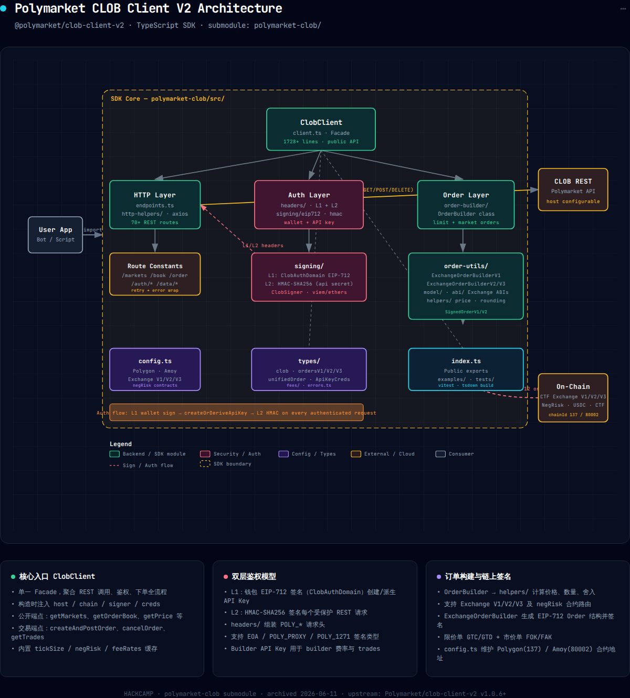

# Project Notes · polymarket-clob

> Source: https://github.com/Polymarket/clob-client-v2
> Read on: 2026-06-10

## 1. 项目在做什么（一句话）

Polymarket CLOB 链下签名挂单 TypeScript SDK

## 2. 顶层架构图

## 3. 核心模块表

| 模块 | 路径 | 职责 | 关键文件 |
|---|---|---|---|
| ClobClient Facade | `polymarket-clob/src/client.ts` | 公开 API、L1/L2 门禁、create+post 编排 | `client.ts` |
| HTTP Layer | `polymarket-clob/src/http-helpers/` | axios 封装、瞬态重试、70+ 路由常量 | `index.ts`, `endpoints.ts` |
| Auth Layer | `polymarket-clob/src/signing/`, `headers/` | L1 钱包 EIP-712 换 API Key；L2 HMAC 签请求 | `eip712.ts`, `hmac.ts`, `headers/index.ts` |
| Order Builder | `polymarket-clob/src/order-builder/` | 用户语义 → raw amounts、tick 舍入 | `orderBuilder.ts`, `helpers/getOrderRawAmounts.ts` |
| Order Utils | `polymarket-clob/src/order-utils/` | V1/V2/V3 TypedData 编码与 EIP-712 签名 | `exchangeOrderBuilderV2.ts`, `model/ctfExchangeV2TypedData.ts` |
| Config & Types | `polymarket-clob/src/config.ts`, `types/` | 链/合约地址表、SignedOrder → REST JSON | `config.ts`, `types/ordersV2.ts` |

## 4. 关键路径示例

用户动作：GTC 限价单 `{ tokenID, price, side, size }` 一键挂单（`createAndPostOrder`）

| 步骤 | 描述 | 文件 / 函数 |
|---|---|---|
| 1 | 用户调用公开 API | `client.ts` · `ClobClient.createAndPostOrder` |
| 2 | 版本缓存 + 自动重试包装 | `client.ts` · `_retryOnVersionUpdate` |
| 3 | Phase A：校验 L1、拉 tick/version/negRisk（可能 HTTP） | `client.ts` · `createOrder` → `get` / `resolveVersion` |
| 4 | 价格校验与舍入 | `utilities.ts` · `priceValid`, `roundNormal` |
| 5 | 业务算量：price/size → maker/taker amounts | `helpers/buildOrderCreationArgs.ts`, `getOrderRawAmounts.ts` |
| 6 | **核心**：EIP-712 Order 链下签名 | `exchangeOrderBuilderV2.ts` · `buildOrderSignature` → `signing/signer.ts` · `signTypedDataWithSigner` |
| 7 | Phase B：SignedOrder 序列化 + L2 HMAC 头 | `types/ordersV2.ts` · `orderToJsonV2`；`headers/index.ts` · `createL2Headers` |
| 8 | POST 提交（跨进程 HTTP） | `http-helpers/index.ts` · `post` → axios `POST /order` |
| 9 | 服务端持久化（SDK 边界外） | Polymarket CLOB 订单簿 / DB |
| 10 | 响应回传或 `ApiError` | `client.ts` · `throwIfError` |

**结论**：最关键一跳是 Step 6 `buildOrderSignature`——Polymarket 采用链下签名、链上验证模型，REST 提交的 body 必须携带对 CTF Exchange domain 的有效 EIP-712 签名，服务端才会接受并写入订单簿。

## 5. 3 个可借鉴的设计点

1. **双层鉴权（L1 钱包 → L2 HMAC）**：高频 REST 若每请求都弹钱包，延迟与 UX 不可接受；Polymarket 用一次性 L1 EIP-712 换取 API Key，之后 L2 HMAC 给每个受保护请求签名。借鉴时定义两套独立 EIP-712 domain（`ClobAuthDomain` vs Order domain），Client 分 `{ signer }` 与 `{ signer, creds }` 两阶段构造。代码：`signing/eip712.ts`, `signing/hmac.ts`, `headers/index.ts`。

2. **签名适配层 `signTypedDataWithSigner`**：调用方可能用 viem `WalletClient` 或 ethers `Signer`，若在 10+ 处各自判断类型，分支会爆炸。借鉴时用 union type + duck typing 收敛到单一签名入口，所有 EIP-712 场景只调一处，单测 mock 一个 fake signer 即可。代码：`signing/signer.ts`。

3. **算量 / 编码 / 传输三层分离 + version retry**：Exchange V1/V2/V3、NegRisk、限价/市价组合多，不宜全堆进 client。借鉴时 helpers 只算 amounts，ExchangeOrderBuilder 只签 TypedData，http-helpers 只管发送；Facade 包 `_retryOnVersionUpdate` 应对协议热升级。代码：`order-builder/helpers/`, `order-utils/`, `client.ts`。

## 6. 代码逻辑架构图

交互式完整版：[polymarket-clob-architecture.html](../day1-onchain-hello/spec/ploymark-origin-doc/polymarket-clob-architecture.html)

上图展示 SDK 内部分层：`ClobClient` Facade 居中调度，向下分 HTTP Layer（axios REST）、Auth Layer（L1 钱包 + L2 HMAC）、Order Layer（OrderBuilder 业务算量）；Order Utils 负责 EIP-712 链下签名，右侧对接 Polymarket CLOB REST API。黄色虚线框为 SDK 边界，链上结算不在此 SDK 调用栈内。

## 7. 我的疑问 / 不确定的点

1. **链上结算何时发生？** `POST /order` 之后订单进入 CLOB 订单簿，但撮合成交后的链上 `fill` / 资金划转完全在 SDK 黑盒之外——不清楚是 Relayer 批量上链还是逐笔结算，对 Paper/Live 风控建模有影响。

2. **该用 submodule 还是 npm / ts-sdk？** 上游 README 已推荐 [Polymarket/ts-sdk](https://github.com/Polymarket/ts-sdk)，且 `clob-client-v2` 已 archived；HACKCAMP 运行时走 npm `@polymarket/clob-client-v2`，submodule 仅作读源码——LiquidityForge 接入时应跟哪个包、何时迁移，还没定。

3. **Exchange V1/V2/V3 路由边界。** SDK 靠 `GET /version` + `negRisk` + `config.ts` 选合约地址，`_retryOnVersionUpdate` 最多重试 2 轮；若升级窗口内 version 与 negRisk 组合判断错了，错误是立即拒单还是 silent 签错 domain——还没实际跑通过。

4. **挂单前是否必须先链上 approve？** SDK 有 `updateBalanceAllowance` / examples 里的 `approveAllowances`，但 `createAndPostOrder` 主路径不强制调用；不确定是服务端代查余额+ allowance，还是 Live 前必须自己先走一遍 examples 流程。

5. **`deferExec` / `postOnly` 的实际语义。** 参数会进 `orderToJsonV2` 传给 REST，但文档较少；做市 bot 挂 GTC 双边单时，这些 flag 对撮合优先级、是否立即进簿的具体行为还不清楚。

6. **POLY_1271（Deposit Wallet）何时需要？** V2 签名有 EOA 与嵌套 `TypedDataSign` 两条路径；普通 EOA 私钥 bot 是否永远走简单分支，Deposit Wallet 是 UI 用户专用还是 bot 也要支持——未验证。

7. **L2 `secret` 在 bot 里的存放方式。** HMAC 密钥与钱包私钥同等敏感；Paper 模式 mock 好说，Live 时 env 注入、creds 轮换、多实例是否共享同一 API Key——工程上还没设计。
